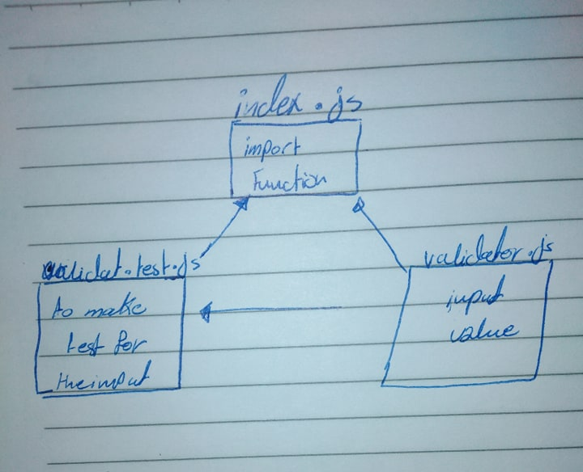

# node-Ecosystem
class-01-Node Ecosystem :star: :star:

# 401-class-01
LAB: Node Ecosystem

# LAB 1

### Author: sohad Qtaitat

### Links and Resources
* [submission PR](https://github.com/401-advanced-javascript-sohad/401-class-01/pull/1)
* [actions](https://github.com/401-advanced-javascript-sohad/401-class-01/commit/1a38293494e12852f1922986d9be95a51eaa3ab9/checks?check_suite_id=411180227)

#### Documentation
* [api docs](http://xyz.com) (API servers)
* [jsdoc](http://xyz.com) (Server assignments)
* [styleguide](http://xyz.com) (React assignments)

### Modules
#### `modulename.js`
##### Exported Values and Methods

###### `foo(thing) -> string`
Usage Notes or examples

###### `bar(array) -> array`
Usage Notes or examples

### Setup
#### `.env` requirements
* `PORT` - Port Number
* `MONGODB_URI` - URL to the running mongo instance/db

#### Running the app
* `npm start`
* Endpoint: `/foo/bar/`
  * Returns a JSON object with abc in it.
* Endpoint: `/bing/zing/`
  * Returns a JSON object with xyz in it.
  
#### Tests
* 'npm test'
* What assertions were made?
* What assertions need to be / should be made?

#### UML
